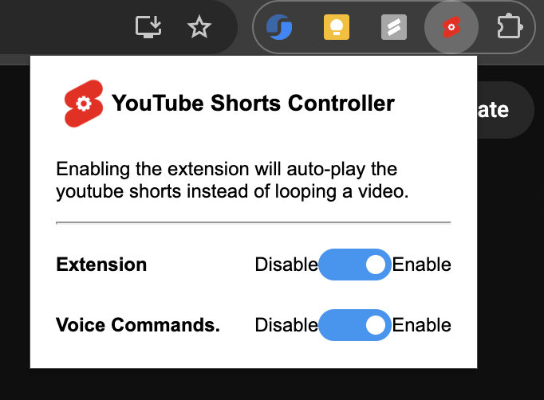

# <a href="https://github.com/theSC0RP/youtube-shorts-controller"></img></a> Youtube Shorts Controller
## A Chrome extension to control the playback of YouTube shorts.

This Chrome extension enhances the experience of watching YouTube Shorts by providing intelligent playback control and hands-free navigation through voice commands.
<ul>

<li>Auto-skip looping Shorts: Detects video end states using the progress bar and automatically plays the next Short, preventing endless loops.
</li>
<li>Built with Manifest V3: Leverages content scripts and background messaging to ensure smooth interaction with the YouTube interface.</li>

<li>Utilizes the Web Speech API to handle real-time voice commands
(play, pause, next, previous, mute, unmute)</li>
</ul>

#### Extension Popup
</img>

#### 💡 How it works?
<ul>
<li>Content scripts monitor the playback progress of Shorts.</li>
<li>Once a video nears completion, the extension triggers navigation to the next video.</li>
<li>Background messaging handles communication between scripts and maintains performance.</li>

<li>Voice recognition runs in the background, listening for specific commands and triggering corresponding actions on the video player.</li>
</ul>

#### 🛠️ TODO

- [ ] Fix content script injection to work without requiring page reload
- [ ] Reduce latency in voice recognition response time